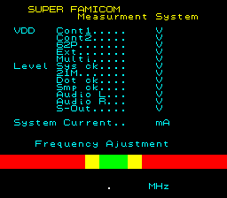

# SNES Aging Test programs

Written, hacked, analyzed, researched & documented by Martin Eesmaa.

Initial date: 03.10.2026

This test software was used within Nintendo's Uji factory in Japan during manufacturing of Super Famicom. v1.00 was produced date in 1990.

Requirements:

- Super Famicom Aging Program V1.00 or V1.02 original ROM file (mandatory)
- Raster/pixel graphics to edit: GIMP, YY.CHR-NET, Aseprite or any raster graphics editor
- Map editing: M8TE (Mode 3 & 7) or/and M1TE2 (Mode 1)
- SNES emulator: MesenCE (recommended), snes9x or bsnes (alternative you can also use physical console with like SD2SNES)

Here are my hacks/modding can do Super Famicom Aging version 1.00:

## SNES Pro Action Replay codes

If you want boot into Super Famicom Measurement System v1.00 menu, activate using Pro Action Replay codes:

```text
0083774C
008378CF
008379AE
```

CPU location address: **$00AECF**

After that it should take you into this, result:



Alternatively, IPS patch file: [SHVC-AGING-MS-v100](patches/SHVC-AGING-MSv100.ips)

If you want to bypass basic tests after errors via old emulators/physical consoles to start anyways Mode background tests, then activate:

```text
0083774C
0083782A
00837999
```

CPU location address: **$00992A**

Note: The audio is out of sync when you bypass basic tests.

## Modding

You are welcome to mod the software aging by replacing text fonts, graphics, edit Mode background via tilemaps and map.

Best to view/emulate/analyze/edit/mod/debug using MesenCE emulator.

To edit tilesets with maps for Mode 1 software editor: M1TE2, Mode 3/7 editor: M8TE

Please note: You must have a tileset, a map and palette all together with M1TE2 or M8TE software editor.

| Data | Program ROM address | Type | Bytes used |
| --- | --- | --- | ---- |
| Texts | `$10000` | 2bps | 8192 bytes 1.00 <br> 16384 bytes 1.02 |
| Sprites | `$12000` 1.00 <br> `$14000` 1.02 | 4bps | 8192 bytes |
| Big sprites | `$14000-15FFF` 1.00 <br> `$16000-17FFF` 1.02 | 4bps | 8192 bytes |
| Mode 3 tilesets | `$8000-BFFF` | 8bps | 16384 bytes |
| Music SPC | `$18000-1A115` | Music | 8470 bytes |
| Palettes | `$2B5A-2C59` (Mode 0 only), `$16B00-16BFF`, `$16800-169FF` (Mode 3 & 7 only) 1.00 <br> `$2D81-2E80` (Mode 0 only), `$1A700-1A7FF`, `$1A400-1A5FF` (Mode 3 & 7 only) 1.02 | Color | 256/512 bytes, total 1024 bytes |
| Mode 7 rotation | `$3809-4348` 1.00 <br> `$3A10-454F` 1.02 | Animation keys | 2880 bytes |

Unused data partitions: Another Mode 3 tilesets from `$C000-FFFF` (16384 bytes, v1.00/1.02) & alternative palette `$16A00-16AFF` (1.00) / `$1A600-1A6FF` (1.02) of 256 bytes

---

| Mode maps | Program ROM address | Bytes |
| --- | --- | --- |
| 0 (only Layer 4) | `$4800-4FFF` (MODE 0 WHITE TEXT), `$5000-57FF` (BLUE TEXT), `$5800-$5FFF` (RED TEXT), `$6000-$67FF` (GREEN TEXT) | Each screen texts has 2048 bytes, makes total 8192 bytes |
| 1 | `$1B000-1B7FF` (Layer 1), `$1B800-1BFFF` (Layer 2) | Each mode layer is 2048 bytes, total 4096 bytes |
| 2 | `$1D000-1D7FF` (Layer 2) | 2048 bytes |
| 3 & 7 | `$16000-167FF` 1.00 <br> `$1A800-1B3FF` 1.02 | 2048 bytes |
| 5 | `$2693` 1.00 <br> `$28C1` 1.02 | 1 byte |
| 6 | `$1C000-1C7FF` (Layer 1) | 2048 bytes |

- 2026 Martin Eesmaa
